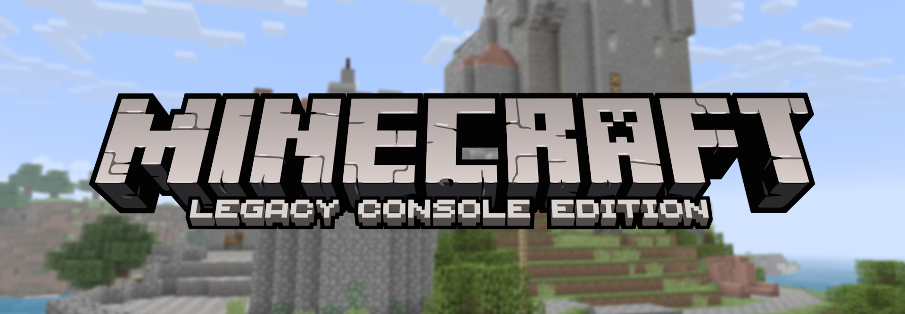

## [LegacyDxncan Account Manager](https://archiedxncan.github.io/LegacyDxncan/)

# Minecraft: Legacy Console Edition

This repository is my personal fork of the Minecraft: Legacy Console Edition source.  

It is primarily used for:

- Implementing new features.
- Integrating and adapting code from other projects.
- Merging useful upstream pull requests that have not yet been merged.
  
---

## 📌 Information
- Build instructions and setup are **not included here**.  
- Support will not be given for forks of this project.
- Please refer to the original projects listed below for documentation & instructions.

---

## ✨ Additions

The following features have been added by me:

- (TU43) Beetroot, Beetroot Seeds, Beetroot Soup.
- Adapted/Continued hugozz26's implementation of UWP support.
- Reimplementation of Leaderboards using PlayFab Leaderboards.
- Implementation of world broadcasting using PlayFab lobbies that only displays worlds from PlayFab friends.
- Fully featured account manager that allows you to add friends via username and authenticates using your uid.

---

## 📦 Included Projects

### 🔹 MinecraftConsoles  
https://github.com/smartcmd/MinecraftConsoles  

Based on **Minecraft Legacy Console Edition v1.6.0560.0 (TU19)**, with various fixes and improvements.

---

### 🔹 LegacyEvolved  
https://codeberg.org/piebot/LegacyEvolved  

A project focused on **backporting newer title updates** to the leaked TU19-based source code.

---

### 🔹 MinecraftLCE-Xbox  
https://github.com/hugozz26/MinecraftLCE-Xbox

A fork of smartcmd/MinecraftConsoles with a full UWP adaptation for Xbox Dev Mode.

---

## 🔀 Merged Pull Requests

The following pull requests have been merged into this fork:

- https://github.com/smartcmd/MinecraftConsoles/pull/1429  
- https://github.com/smartcmd/MinecraftConsoles/pull/1065  
- https://github.com/smartcmd/MinecraftConsoles/pull/1350
- https://github.com/smartcmd/MinecraftConsoles/pull/1048  

